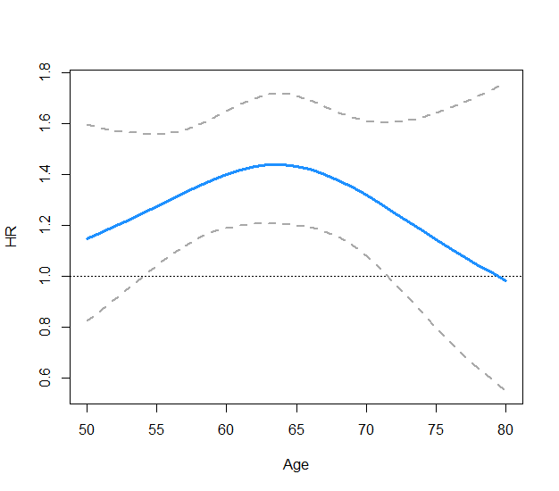

# Summary

Statistical and biostatistical research are often interested in situations where the main effect of a predictor of interest varies over levels of another predictor. In clinical studies this common situation arises, for example, when the effect of a new treatment in a randomized clinical trial (RCT) changes over levels of participants characteristics such as sex or age. In this context, the joint effect of the two predictors of interest (treatment and age, for example) on a given response is captured by their independent effects and by an interaction effect that quantifies the additional change in the response when both predictors are operating. A thorough description of interaction effects and their interpretation and relevance can be found in @vanderweele2014tutorial. 

In practice, interaction assessment is commonly conducted by including a product term between the two predictors of interest in a statistical model. For instance, in a RCT investigating the effect of a novel treatment on cardiovascular mortality researchers might fit a Cox PH regression that includes a first term for treatment, a second term for the second predictor, and a third term for the interaction between treatment and the other predictor. If the second predictor was a binary variable (e.g. participants sex), the treatment effect would be summarized with two different parameters, one for each value of sex. On the other hand, with a continuous predictor such as age, the effect of the main predictor would require some graphical presentation. Figure 1 provides an example of such graphical presentation presenting the treatment effect, in the form of a hazard ratio (HR), over levels of participants age.(this figure is a place holder, will use a nice exaple that clearly shows linearity and then non-linearity)

When dealing with continuous predictors such as age, researchers need to take into account the linearity assumptions made by the different statistical models. In particular, the most common statistical approaches used in clinical research share an assumption of linearity either on the response (linear regression), on the logit of the event probability (logistic regression), or on the logarithm of the hazard ratio (Cox PH regression). In the context of interaction analysis, this not only implies that the effect of each continuous predictor will be linear on the underlying scale, but also that the interaction term will be linear. Using the example presented in Figure 1, the treatment effect changes over age levels in a log-linear fashion. This assumption is often not met in real data, and different approaches to relax linearity exist. Among them, modeling continuous predictors with restricted cubic splines represent one of the most flexible approaches, currently recommended by several guidelines and researchers.(@greenland1995dose, @von2007strengthening, @durrleman1989flexible) An introduction to restricted cubic splines can be found in Chapter 2.4 of @harrell2017regression. On our github page we provide a detailed presentation of the mathematical formulation for linear, logistic, and Cox regression models, when an interaction is included and modeled with restricted cubic splines. By using this flexible approach, the linearity assumption is relaxed and the interaction effect can be graphically displayed with a smooth and flexible function that more accurately captures how the main effect changes over levels of the other predictors. Figure 2 presents the treatment/age interaction previously described, now flexibly modeled with this approach.(figure is a place holder, need to find one where we clearly see a smooth non linear function)

To the best of our knowledge, simple procedures to obtain such graphical presentation of interaction effects, while allowing for flexible restricted cubic splines modeling, are unavailable in all major statistical software. The `interactionRCS` package that we have developed includes a set of functions that allows deriving these graphical presentations after fitting a linear, logistic, or a Cox PH regression model in `R`. The package .... quick description of the main features to be added after the package has been finalized.

# References

